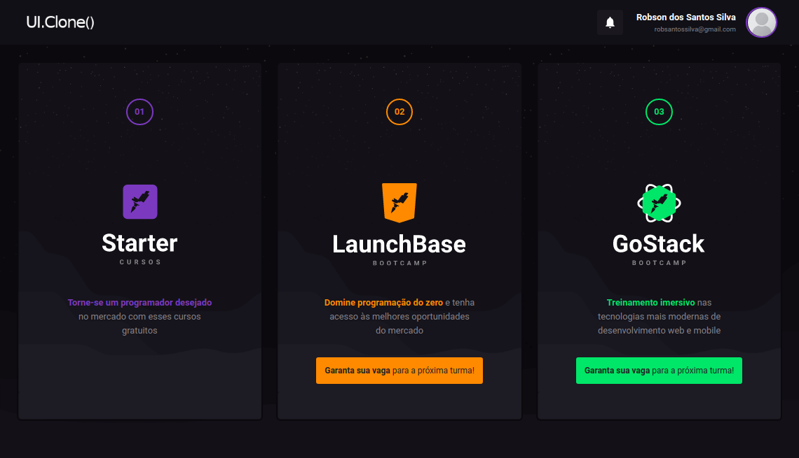
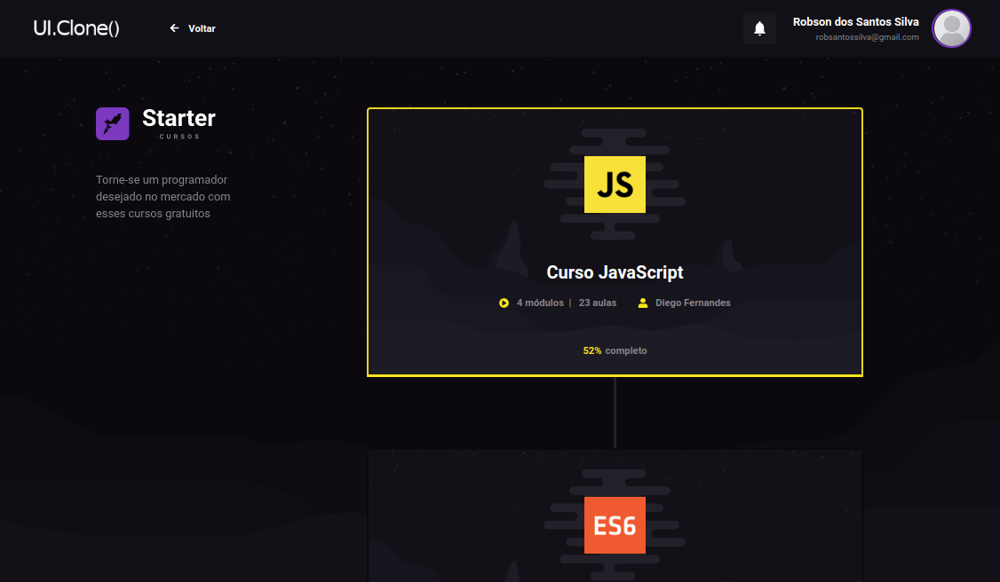
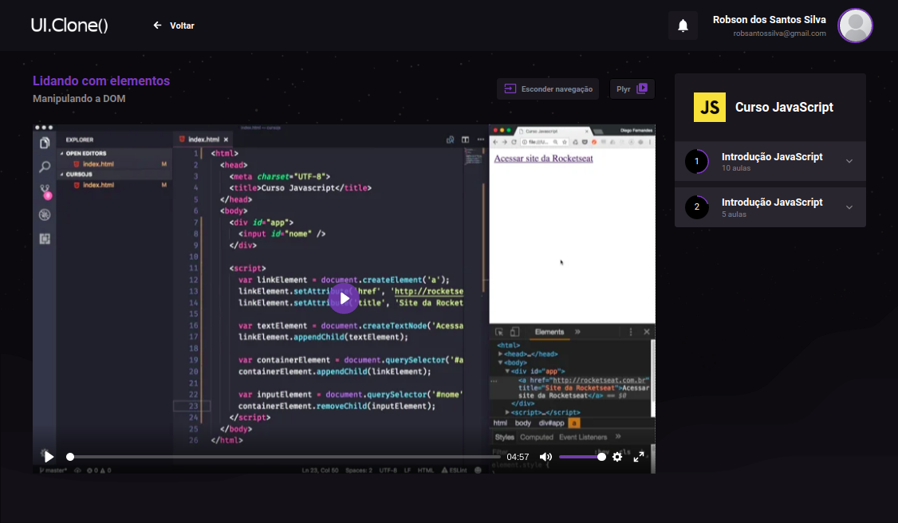

<h1 align="center">UI.Clone('Skylab Rocketseat')</h1>
<p align="center">
  <a aria-label="Versão do React" href="https://github.com/facebook/react/blob/master/CHANGELOG.md#16120-november-14-2019">
    </img>
  </a>
</p>

<p align="center">
    Como parte do meu aprendizado em <strong>React.js</strong> decidi fazer uma coṕia da plataforma de cursos da Rocketseat. 
</p>

- Todo layout está <strong>componetizado</strong>.
- Preparado para trabalhar com <strong>Redux</strong>.
- <strong>react-router-dom</strong> está sendo utilizado para navegação.

## Iniciando o Frontend
```bash
npm install
npm start
```

</img>

</img>

</img>